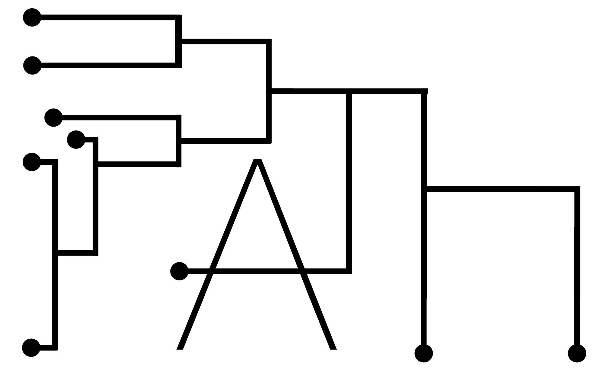

# PATH: Phylogenetic Analysis of Trait Heritability

<p align="center">
  
</p>

*Please note that this software is not ready for general use
as it is still in development and being updated.*  

PATH is an R package for analyzing multi-modal single-cell phylogenies, developed and
maintained by the Landau Lab at the New York Genome Center \& Weill Cornell Medicine.

For more information and background, as well as technical details, see our manuscript
[Defining ancestry, heritability and plasticity of cellular phenotypes in somatic evolution](https://www.biorxiv.org/content/10.1101/2022.12.28.522128v2).
 
### Installation 
```r
install.packages("devtools")
devtools::install_github("landau-lab/PATH")
```

### Introduction
**PATH** -- the **P**hylogenetic **A**nalysis of **T**ranscriptional 
**H**eritability -- is an analytical framework for quantifying cell state heritability
versus plasticity and inferring cell state transition dynamics, in the context of
*somatic evolution*, by using phenotypically annotated single-cell lineage trees or phylogenies. 

Single-cell phylogenies represent the ancestral
relatedness of individual cells, and if annotated with additional 
measurements, such as transcriptional state (*e.g.*, from scRNAseq),
present a unique opportunity to study somatic evolutionary dynamics. 
PATH's analytical tools can be applied to these types of data to, 
* (i) quantify cell state heritability versus plasticity by measuring *phylogenetic correlations*,
* (ii) infer phenotypic transition dynamics, and further, 
* (iii) identify heritable gene modules or pathways.  

### Vignettes
For examples of how to apply PATH, see the vignettes listed below. 

* [PATH analysis of idealized phylogenies](https://htmlpreview.github.io/?https://github.com/landau-lab/PATH/blob/main/docs/Idealized_phylogenies.html)
demonstates how to use PATH to measure phylogenetic correlations and how to infer cell state transition dynamics
on simulated *idealized phylogenies*. Idealized phylogenies represent a simplified situation useful for
understanding how PATH works. 
* [PATH analysis of somatic evolution](https://htmlpreview.github.io/?https://github.com/landau-lab/PATH/blob/main/docs/Somatic_evolution.html) 
demonstates how to use PATH to measure phylogenetic correlations and how to infer cell state transition dynamics
on phylogenies simulated by a *sampled somatic evolutionary process*. These phylogenies should more closely
resemble those derived from experiment.

* [PATH analysis of cancer](https://htmlpreview.github.io/?https://github.com/landau-lab/PATH/blob/main/docs/Glioblastoma.html) demonstrates how to apply PATH to an experimentally derived single-cell phylogeny
with matching scRNAseq. Specifically, in this vignette, PATH is applied to a patient-derived
glioblastoma phylogeny,
to measure transcriptional cell state heritability versus plasticity, 
to infer cell state transition dynamics, and
to discover heritable transcriptional modules in an unbiased fashion.

### Interactive PATH Simulator
This interactive [PATH Simulator](https://joshseth.shinyapps.io/shinyPATH/) web app can also be used for simple demonstrations. 

